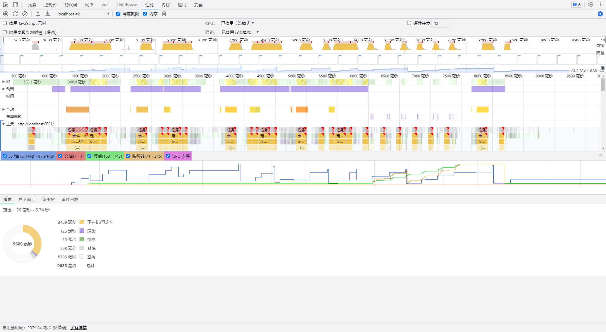
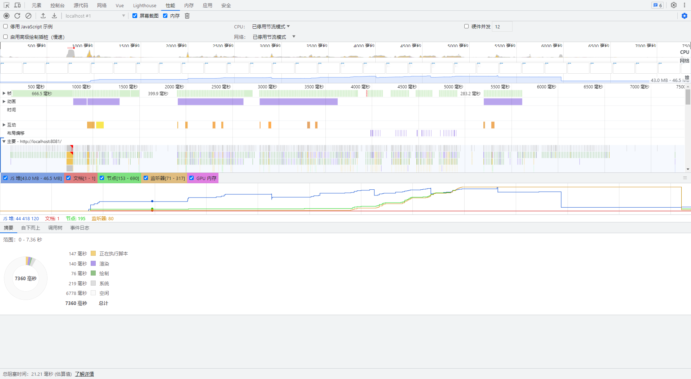

# VirtualizedSelect

Vue2.x component for virtualized select

使用VxeTable的虚拟列表实现的虚拟下拉框，近似实现Element-Select功能

## Install
```bash
npm install virtualized-select
```

## Usage
```js
import VirtualizedSelect from 'virtualized-select'
import 'virtualized-select/dist/virtualized-select.css'

Vue.use(VirtualizedSelect)
```

## Example
```vue
<template>
  <div>
    <virtualized-select
      v-model="value"
      :options="list"
    />
  </div>
</template>

<script>
export default {
  data() {
    return {
      value: '',
      list: new Array(10000 * 5).fill().map((_, index) => ({
        label: index.toString(),
        value: index
      })),
      // 更推荐如下写法，使用Object.freeze冻结数据，因为大多数情况下，下拉列表并不需要响应式
      // 如果需要修改原始数据，可以直接赋值修改
      freezeList: Object.freeze(new Array(10000 * 5).fill().map((_, index) => ({
        label: index.toString(),
        value: index
      })))
    }
  }
}
</script>
```

## Performance
可自行加载 `src/assets` 下的火焰图进行对比

冻结前


冻结后


## TODO
- [ ] size
- [ ] 支持创建不存在的值
- [ ] 支持对象做值，类似el-select传入value-key
